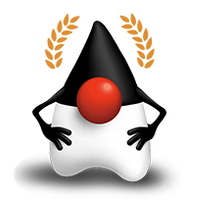
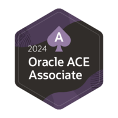
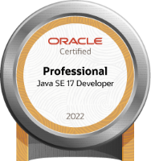
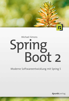
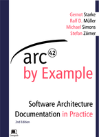
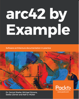
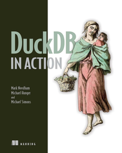

Hi there 👋

I'm Michael, software engineer from Germany. My official title is _Senior Staff Software Engineer_ and I work at [Neo4j](https://neo4j.com).
I am an [iSAQB®](https://www.isaqb.org) certified professional for Software Architecture.
Titles which theoretically would fit as well "does stuff with or do computers", "break things as a service" and "source of endless rants" 😉.

I have been working in IT since the early 2000s. My goto language of choice is Java ☕️.
I am a published author ([arc42 by example, EN 2014 – 2015](https://leanpub.com/arc42byexample), ["Spring Boot - Moderne Softwareentwicklung im Spring Ökosystem", DE 2018](http://springbootbuch.de) and ["DuckDB in Action", EN 2024](https://www.manning.com/books/duckdb-in-action)) and a recognized [Java Champion](https://dev.java/community/jcs/).
In recognition and appreciation for my technical and community leadership contributions to the Oracle communities worldwide demonstrated during June 2022 – May 2023 through my work regarding GraalVM I was presented an Oracle Ace Associate award in 2024.
I hold a bunch of certificates, including all Java LTS releases since 1.5, and several from [Neo4j](https://graphacademy.neo4j.com/c/b8e56e73-6367-4a2d-a2fe-67c7bf5af206), covering databases versions 3.5, 4 and 5.
The PRINCE2® Registered Practitioner was time-limited and ended in 2018.

&#160;&#160;
&#160;&#160;&#160;&#160;

I am a Spring User for more than a decade and one of my earliest projects  ([Dailyfratze](https://dailyfratze.de/pages/technical_details?lang=en)) is still around, alive 
and kicking.
In 2015 I founded the Java user group [EuregJUG Maas-Rhine](http://euregjug.eu) together with @dl1ely.

I have contributed to broad number of frameworks and ecosystems, such as

* [Spring Boot](https://github.com/spring-projects/spring-boot/commits?author=michael-simons)
* [Spring Security](https://github.com/spring-projects/spring-security/commits?author=michael-simons)
* [Spring Data JDBC](https://github.com/spring-projects/spring-data-relational/commits?author=michael-simons)
* [Quarkus](https://github.com/quarkusio/quarkus/commits?author=michael-simons)
* [Neo4j](https://github.com/neo4j/neo4j/commits?author=michael-simons)
* [jOOQ](https://github.com/jOOQ/jOOQ/commits?author=michael-simons)

Since 2018 I am the maintainer of [Spring Data Neo4j](https://github.com/spring-projects/spring-data-neo4j) and [Neo4j-OGM](https://github.com/neo4j/neo4j-ogm) together
with [@meistermeier](https://github.com/meistermeier).

I created the following projects which I do actively maintain:

* [Cypher-DSL](https://github.com/neo4j-contrib/cypher-dsl): A query builder for Neo4js query language Cypher, heavily inspired by jOOQ.
* [Neo4j-Migrations](https://github.com/michael-simons/neo4j-migrations): Database refactoring toolkit for Neo4j, with integrations for Quarkus and Spring Boot and a native CLI.
* [biking2](https://github.com/michael-simons/biking2): A project around cycling which I used to learn Spring Boot and educate about Spring Boot.
* [biking3](https://github.com/michael-simons/biking3): The sequel of `biking2`, based on DuckDB 🐥 and Python 🐍 with Flask; I'm pretty happy with the outcome: Lots of cool SQL and my own static site generator.
* [scrobbles4j](https://codeberg.org/michael-simons/scrobbles4j): Years of giving talks about relational databases and tracking listening habbits culminated in a life application displaying my latest songs.

My effort for the Neo4j Testcontainers integration started back in [2018](https://github.com/testcontainers/testcontainers-java/pull/993) and cumulated in Neo4j being one of six launch partners for the [AtomicJar official Testcontainers modules](https://www.atomicjar.com/2023/04/testcontainers-official-modules/).
In mid 2023 I was recognized by [AtomicJar](https://www.atomicjar.com/2023/07/announcing-the-testcontainers-community-champions-program/) as [Community Champion](https://testcontainers.com/community-champions/michael-simons/) together with a great group of other [champions](https://testcontainers.com/community-champions/). I feel really honored to be part of that group.

For my work integration the Neo4j Java-Driver and Neo4j-OGM into Quarkus with [Quarkus-Neo4j](https://github.com/quarkiverse/quarkus-neo4j) and [Neo4j-Quarkus-OGM](https://github.com/neo4j/neo4j-ogm-quarkus) I was awarded 3 times in a row with "I Made Quarkus" (1.x, 2.x and 3.x). 

Since 2019 I was the driving author behind making the Neo4j-Java-Driver compatible and officially tested with [GraalVM](https://www.graalvm.org/native-image/libraries-and-frameworks/), see [634](https://github.com/neo4j/neo4j-java-driver/pull/634), [663](https://github.com/neo4j/neo4j-java-driver/pull/663) and [neo4j-java-driver-native-smoke-tests](https://github.com/neo4j-drivers/neo4j-java-driver-native-smoke-tests).

I am the project lead for the [Neo4j JDBC Driver v6](https://github.com/neo4j/neo4j-jdbc/tree/main), including a unique approach of translating SQL to Cypher, by combining jOOQ *and* the Cypher-DSL.

In 2023 I started writing my third book, [DuckDB in Action](https://www.manning.com/books/duckdb-in-action), together with [Michael Hunger](https://github.com/jexp) and [Mark Needham](https://github.com/mneedham). 
The book went to print in July 2024, and is available in various formats at Manning and of course, on Amazon.

Last but not least, I have this [Advent of Code](https://github.com/michael-simons/aoc) repository in which I went a bit nuts in terms of programming languages:
I love Java, but I try to stay on top of other things, too.

Apart from all of that, I have a blog [info.michael-simons.eu](https://info.michael-simons.eu), my slides are on [speakerdeck](http://speakerdeck.com/michaelsimons), I answer
stuff on [stackoverflow](https://stackoverflow.com/users/1547989/michael-simons) and I do have a [LinkedIn profile](https://www.linkedin.com/in/michael-simons-196712139/).
However, my primary feed is on Mastodon, I am <a rel="me" href="https://mastodon.social/@rotnroll666">@rotnroll666@mastodon.social</a>.
My old Twitter [account](https://twitter.com/rotnroll666) still exists, but I refuse to give this company any more content, and you shouldn't either. I won't accept any new follower requests there.

&#160;&#160;
&#160;&#160;
&#160;&#160;

